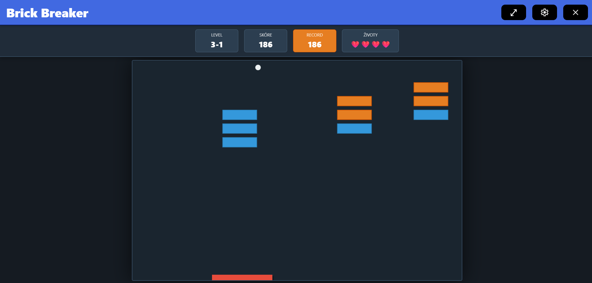
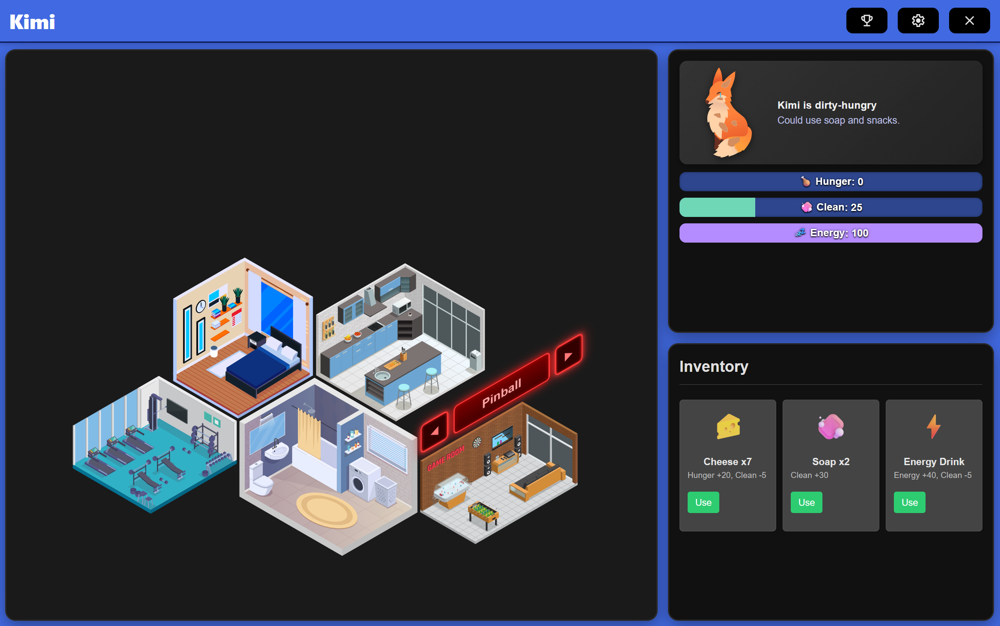
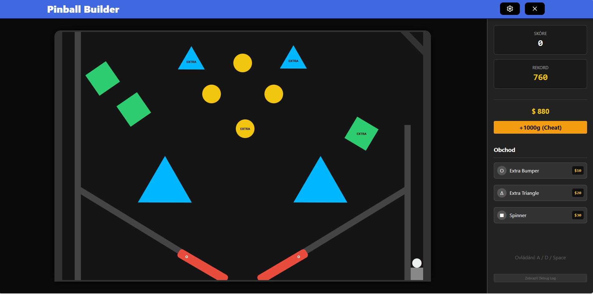
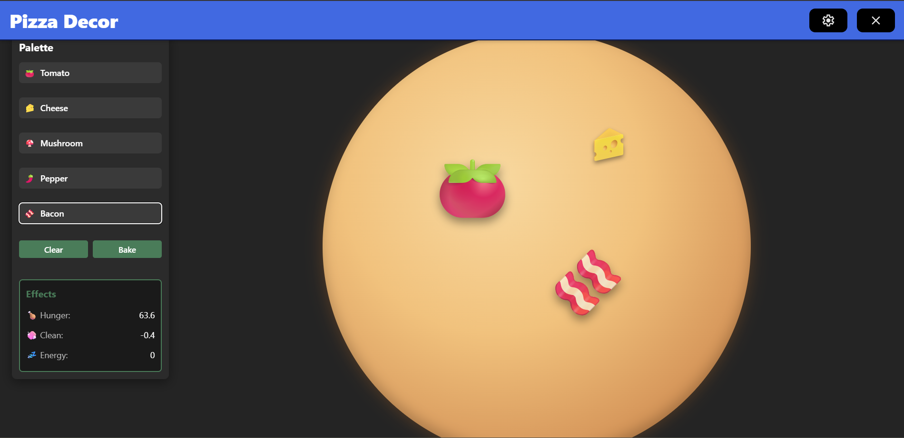
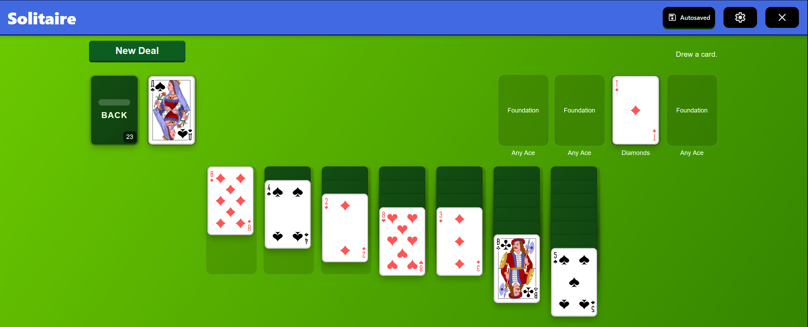
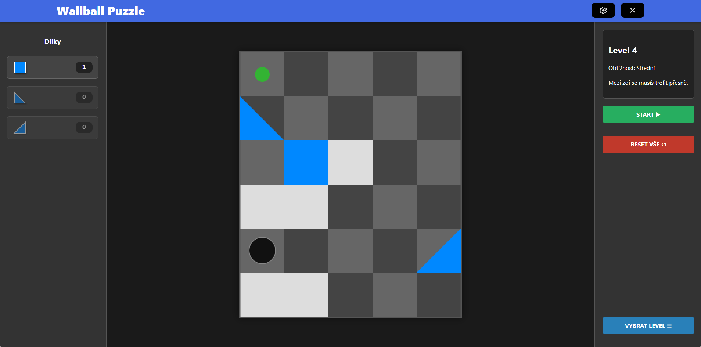

# ITU_Project_2025
GUI oriented project from ITU (User Interface Programming) class 

# Dependencies
- Win10/11
## Python (3.10+)
- download https://www.python.org/downloads/windows/
- Check "Add Python to PATH" during install
- Backend `pip install flask flask-cors`
## Node.js
- download https://nodejs.org/en/download
- installer should add `npm` to PATH
- general libs `npm install` inside frontend folder
- ~~HTTP `npm install axios`~~
- ~~`npm install react-router-dom`~~

# ~~Create React project with Vite~~
~~`npm create vite@latest frontend -- --template react`~~
## 1) Run Backend
`cd backend`
`python server.py`
## 2) Run Frontend (React dev server)
`cd frontend`
`npm run dev`

## 3) Open in browser
http://localhost:5173

## Screenshots

### Breaker


### Main Menu


### Pinball


### Pizza


### Solitaire Menu


### Wallball



# File structure (frontend/src)
```py
│   Achievements.jsx (Jaroslav Mervart)
│   App.jsx (Jaroslav Mervart)
│   Breaker.jsx (Šimon Dufek)
│   breaker_levels.js (Šimon Dufek)
│   Inventory.jsx (Šimon Dufek)
│   main.jsx 
│   Pinball.jsx (Pavel Hýža)
│   PizzaBaking.jsx (Šimon Dufek)
│   PizzaDecor.jsx (Šimon Dufek)
│   Settings.jsx (Jaroslav Mervart)
│   Solitaire.jsx (Jaroslav Mervart)
│   Wallball.jsx (Pavel Hýža)
│   wallball_levels.js (Pavel Hýža)
│
├───assets 
│
├───controllers
│       achievementController.js (Jaroslav Mervart)
│       breakerController.js (Šimon Dufek)
│       kimiController.js (Jaroslav Mervart)
│       pinballController.js (Pavel Hýža)
│       pizzaController.js (Šimon Dufek)
│       sceneController.js (Jaroslav Mervart)
│       solitaireController.js (Jaroslav Mervart)
│       wallballController.js (Pavel Hýža)
│
├───meta_components
│       AchievementBox.jsx (Jaroslav Mervart)
│       AchievementContext.jsx (Jaroslav Mervart)
│       AchievementInfo.jsx (Jaroslav Mervart)
│       Header.jsx (Jaroslav Mervart)
│       KimiStatus.jsx (Jaroslav Mervart)
│       Scene.jsx (Jaroslav Mervart)
│       SceneCarousel.jsx (Jaroslav Mervart)
│       SceneObject.jsx (Jaroslav Mervart)
│       SolitaireCard.jsx (Jaroslav Mervart)
│       StatusBar.jsx (Jaroslav Mervart)
│
├───models
│       achievementModel.js (Jaroslav Mervart)
│       breakerModel.js (Šimon Dufek)
│       kimiModel.js (Jaroslav Mervart)
│       kimiMoodModel.js (Jaroslav Mervart)
│       pinballModel.js (Pavel Hýža)
│       pizzaModel.js (Šimon Dufek)
│       sceneModel.js (Jaroslav Mervart)
│       settingsModel.js (Jaroslav Mervart)
│       solitaireModel.js (Jaroslav Mervart)
│       solitaireProgressModel.js (Jaroslav Mervart)
│       wallballModel.js (Pavel Hýža)
│
└───styles
        AchievementBox.css (Jaroslav Mervart)
        AchievementInfo.css (Jaroslav Mervart)
        Achievements.css (Jaroslav Mervart)
        App.css (Jaroslav Mervart, Šimon Dufek, Pavel Hýža)
        Breaker.css (Šimon Dufek)
        Header.css (Jaroslav Mervart)
        index.css
        Inventory.css (Šimon Dufek)
        KimiStatus.css (Jaroslav Mervart)
        Pinball.css (Pavel Hýža)
        PizzaBaking.css (Šimon Dufek)
        PizzaDecor.css (Šimon Dufek)
        SceneCarousel.css (Jaroslav Mervart)
        Settings.css (Jaroslav Mervart)
        Solitaire.css (Jaroslav Mervart)
        StatusBar.css (Jaroslav Mervart, Veronika Kubová)
        Utils.css (Jaroslav Mervart)
        Wallball.css (Pavel Hýža)
```

# Final evaluation (including documentation and others)
47 - 50 points
